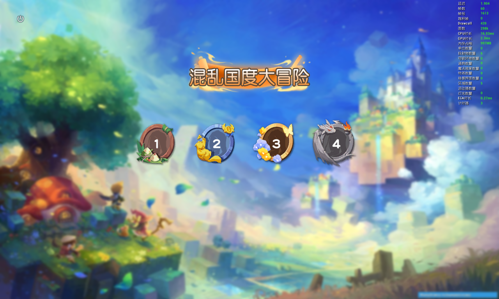
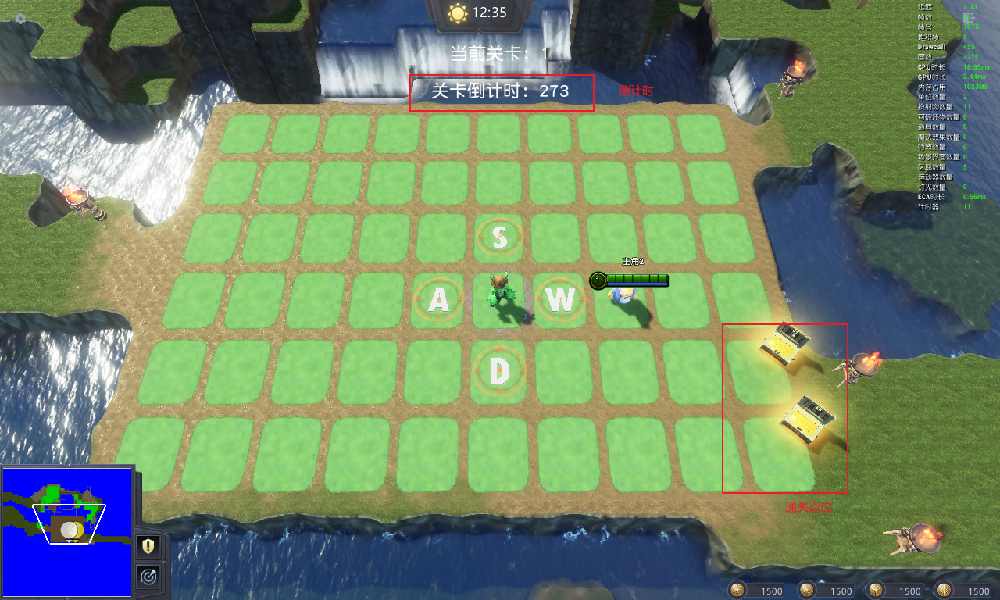
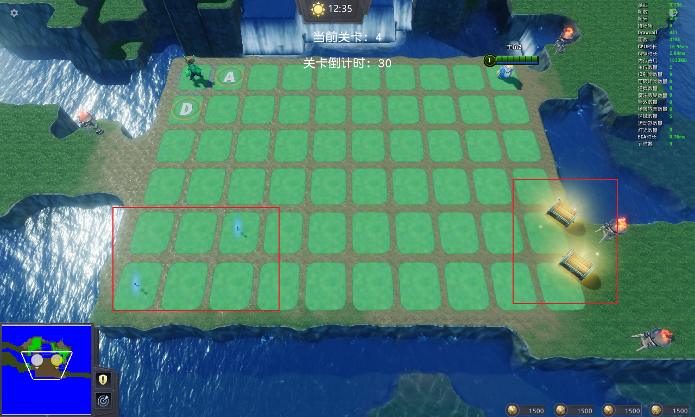
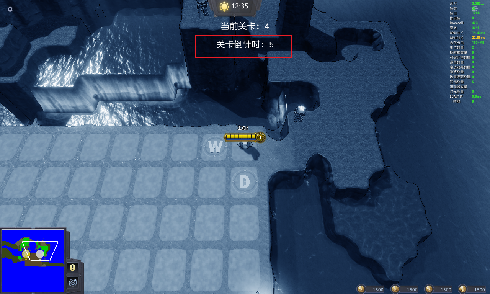
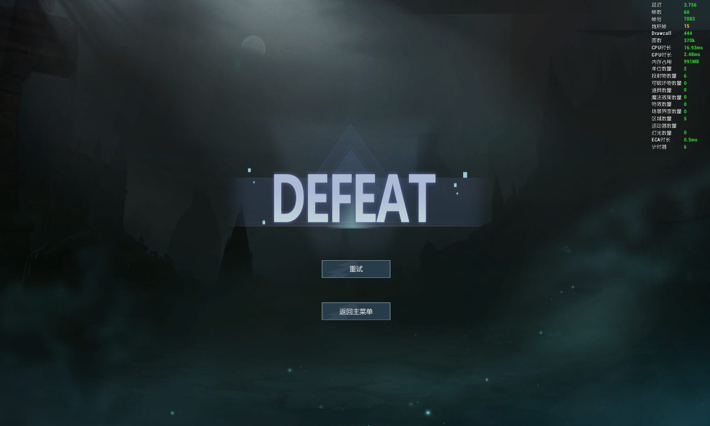

# 混乱国度大冒险

游戏一共有四关，具有完整的局内局外循环，目前仅支持两名玩家同时游玩。

> 不知道怎么打包，目前游戏的启动方式是使用本地多开，配置两名玩家即可

玩家需要根据一定的**移动规则**，在指定时间内到达指定点位视为完成关卡。

* 移动规则：主角每次移动会在周围4个方向随机生成按键提醒，按下指定方向键可完成对应方向的移动。（例如，下图中的主角，如果想往屏幕下方移动，就需要按下D）。为了确保两名玩家走到同一点位随机方向的一致性，整张地图的随机值会在加载关卡时决定。

如果宝箱是锁住的，就需要通过拾取钥匙解锁，才可以通关。

当倒计时所剩无几时，画风会变为黑白，提供紧迫感。

失败与胜利界面

> TODO：
>
> * 引入怪物和Boss战
> * 引入玩家间交互（如互救机制等）
> * 引入随机掉落的道具
> * 。。。。。。
